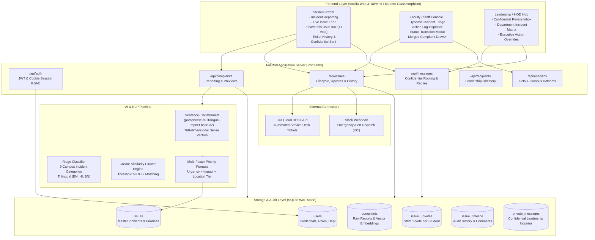
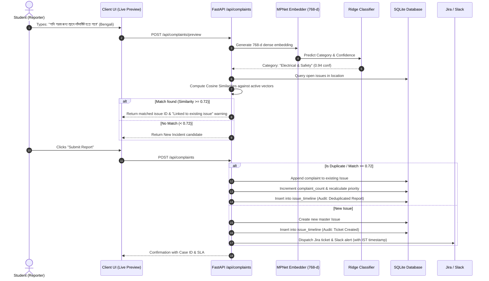
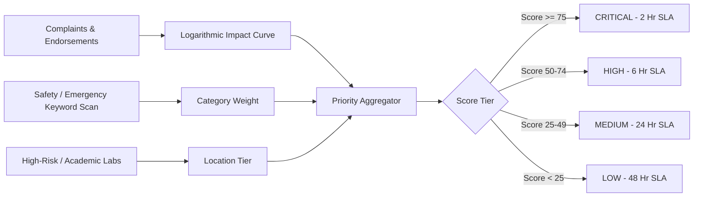
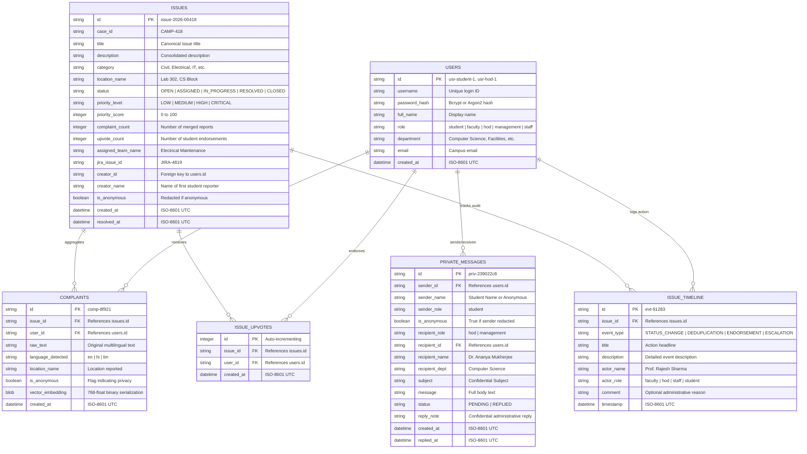
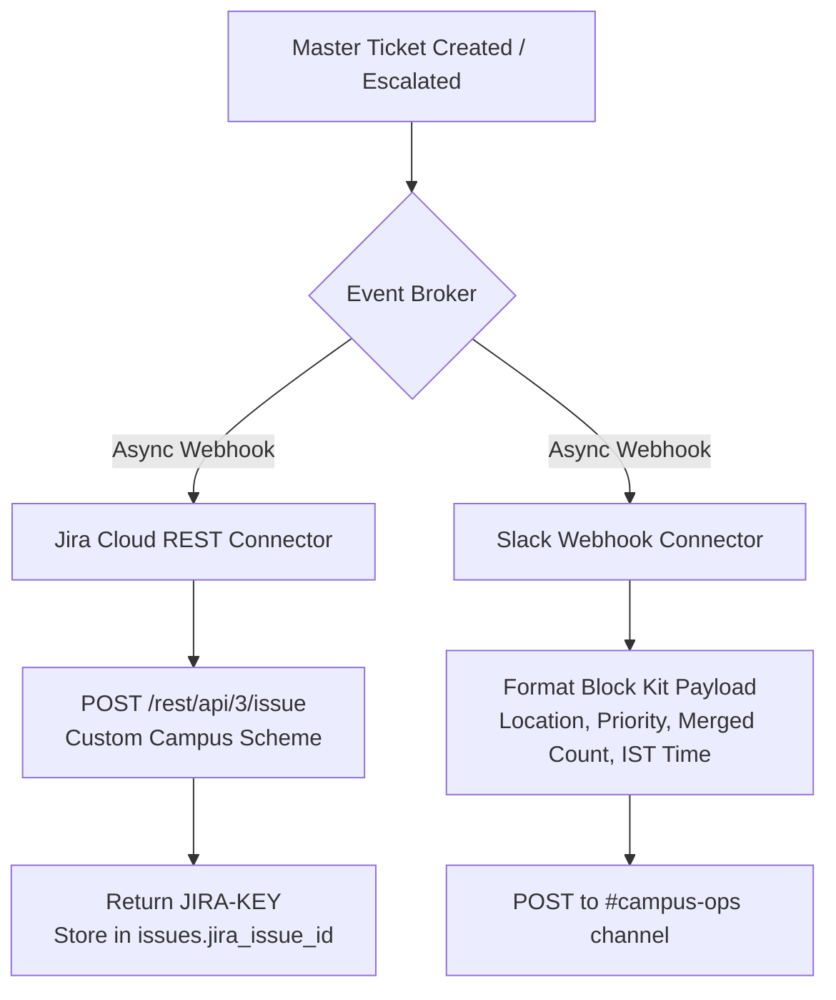

# CampusPulse (Campus+) — Architecture & Technical Design

## 1. Executive Summary & Core Philosophy

**CampusPulse** is an enterprise-grade, intelligent campus incident reporting, semantic deduplication, and resolution tracking system. In large collegiate environments, facility breakdowns (e.g., water leaks, AC failures, electrical hazards, broken equipment) typically suffer from:
1. **Complaint Avalanche & Duplicate Noise**: Dozens of students report the same broken water cooler or lab PC using slightly different wording across multiple languages (English, Hindi, Bengali).
2. **Context Loss & Lack of Traceability**: Maintenance staff mark tickets as "In Progress" or "Resolved" without accountability, audit logs, or administrative notes.
3. **Role Sprawl & Information Clutter**: Students are overwhelmed by administrative controls, while faculty/management lack clean incident triage tools.
4. **Time Discrepancies**: Global UTC timestamps confuse campus teams operating on standard local time (IST).

CampusPulse eliminates these bottlenecks through a **Zero-Noise, High-Accuracy Architecture**:
- **Trilingual Multilingual NLP Engine** powered by `paraphrase-multilingual-mpnet-base-v2`.
- **Vector-Based Semantic Deduplication ($\ge 0.72$ Cosine Similarity)** clustering redundant complaints into unified master tickets.
- **Strict Role-Based Access Control (RBAC)** across Student, Faculty, HOD, Management, and Staff.
- **Single-Vote Student Endorsement Engine ("I have this issue too")** boosting real-time urgency without duplicate tickets.
- **Immutable Action Log Audit Trail** capturing actor name, role, timestamp in **Indian Standard Time (IST)**, and mandatory/optional resolution comments.
- **Confidential Leadership Routing** for sensitive grievances submitted directly to HODs and Deans.

---

## 2. High-Level System Architecture



---

## 3. Multilingual NLP & Deduplication Pipeline

CampusPulse guarantees **zero duplicate work orders** through a 3-stage natural language pipeline:



### 3.1 Model Architecture & Specifications
- **Embedding Model**: `paraphrase-multilingual-mpnet-base-v2` (768 embedding dimensions, 128 max sequence length, normalized Euclidean unit vectors).
- **Linguistic Coverage**:
  - **English**: Formal and colloquial campus complaints.
  - **Hindi (Devanagari & Romanized Hinglish)**: e.g., *"कंप्यूटर लैब में एसी काम नहीं कर रहा"* and *"water cooler leak ho raha hai"*.
  - **Bengali (Bengali script & Romanized)**: e.g., *"ল্যাব ৩ এ ফ্যান ঘুরছে না"* and *"pani porche bathroom e"*.
- **Classification Head**: L2-regularized linear Ridge classifier trained across 9 campus operational categories:
  1. `Infrastructure & Civil`
  2. `Electrical & Safety`
  3. `Water & Sanitation`
  4. `IT & Network Equipment`
  5. `HVAC & Ventilation`
  6. `Hostel & Residential Facilities`
  7. `Library & Study Spaces`
  8. `Canteen & Food Services`
  9. `Campus Security & Surveillance`

### 3.2 Mathematical Deduplication Formulation
Given an incoming complaint $c_{new}$ with 768-d normalized embedding vector $\mathbf{v}_{new}$ and a set of currently active open issues $\{I_1, I_2, \dots, I_m\}$ within the same or neighboring campus zone:

$$\text{Cosine Similarity}(c_{new}, I_k) = \frac{\mathbf{v}_{new} \cdot \mathbf{v}_{I_k}}{\|\mathbf{v}_{new}\| \|\mathbf{v}_{I_k}\|} = \mathbf{v}_{new} \cdot \mathbf{v}_{I_k} \quad (\text{since } \|\mathbf{v}\| = 1)$$

$$\text{Deduplication Decision} = \begin{cases} \text{Merge into } I^* = \arg\max_k \text{Sim}(c_{new}, I_k) & \text{if } \max_k \text{Sim} \ge 0.72 \\ \text{Create New Incident Ticket} & \text{otherwise} \end{cases}$$

---

## 4. Multi-Factor Priority Escalation Engine

Every incident ticket dynamically evaluates a priority score $S \in [0, 100]$ upon every new student report or single-vote endorsement:

$$S = \min\left(100, \left(W_{\text{cat}} \times C\right) + \left(W_{\text{loc}} \times L\right) + \left(W_{\text{urg}} \times U\right) + \left(W_{\text{vol}} \times \ln(1 + N_{\text{reports}} + 0.5 \times N_{\text{votes}})\right)\right)$$

Where:
- **Category Severity ($C \in [10, 40]$)**: Electrical & Safety ($40$), Water & Sanitation ($30$), IT Infrastructure ($25$), General Civil ($15$).
- **Location Sensitivity ($L \in [10, 30]$)**: Server Rooms, Substations & Chem Labs ($30$), Classrooms & Library ($20$), Corridors & Open Grounds ($10$).
- **Student Endorsement Headcount ($N_{\text{reports}}, N_{\text{votes}}$)**: Sub-linear logarithmic amplification ensuring issues with 25+ endorsements automatically breach the **Critical Tier ($S \ge 75$)**.



---

## 5. Role-Based Access Control (RBAC) & View Isolation

CampusPulse strictly enforces least-privilege access at both the API and client presentation tiers:

| Role | Incident Reporting | Endorsement Voting | Incident Console Triage | Show Action Log | Add Action Comments | Confidential Leadership Inbox |
| :--- | :---: | :---: | :---: | :---: | :---: | :---: |
| **Student** | Yes (Public / Anon / Private) | **Yes** (Strict 1-vote/ticket) | No (Hidden) | Yes (View-only) | No | No (Only view own sent replies) |
| **Faculty** | View / Track | No (View count only) | **Yes** (Update status) | Yes | **Yes** (With status update) | No |
| **HOD** | View / Track | No (View count only) | **Yes** (Department view) | Yes | **Yes** (With status update) | **Yes** (Direct student inquiries) |
| **Management** | View / Track | No (View count only) | **Yes** (Campus-wide view) | Yes | **Yes** (Executive override) | **Yes** (Campus-wide appeals) |
| **Staff** | View / Track | No (View count only) | **Yes** (Assigned tasks) | Yes | **Yes** (Work log notes) | No |

### View-Filtering Rules
1. **Student View**: Displays only the **Report an Issue** form, the **Campus Live Issues** feed, and **My Ticket History**. Administrative tabs are never rendered in the DOM for students.
2. **Staff / Faculty View**: Displays the unclipped **Incident Console** and **Resolved Archive**. The student reporting form and leadership inbox are omitted.
3. **Leadership View (HOD & Management)**: Displays the **Confidential Inbox**, **Incident Console**, and **Resolved Archive**.

---

## 6. Database Schema & Entity Relationship Diagram (ERD)

The persistent store is built on **SQLite 3** running with Write-Ahead Logging (`PRAGMA journal_mode=WAL;`), foreign keys enabled, and indexing on lookups.



---

## 7. Timezone Standard: Indian Standard Time (IST)

To prevent operational ambiguity between student submissions, maintenance rounds, and administrative sign-offs:
1. **Persistence Protocol**: Stored internally as standard UTC ISO-8601 (`YYYY-MM-DDTHH:MM:SS.mmmmmmZ`) for universal database consistency.
2. **Client-Side Rendering**: Normalized via `formatISTTime()`:
   ```javascript
   function formatISTTime(dateStr, includeSeconds = false) {
     let normalizedStr = String(dateStr).trim();
     if (!normalizedStr.endsWith('Z') && !/[+-]\d{2}:?\d{2}$/.test(normalizedStr)) {
       normalizedStr += 'Z';
     }
     const d = new Date(normalizedStr);
     return `${d.toLocaleString('en-IN', { timeZone: 'Asia/Kolkata', ... })} IST`;
   }
   ```
   *Displays as:* `12 Sep, 03:07 PM IST` across all student cards, ticket tables, audit timelines, and leadership inboxes.
3. **Outbound Webhooks**: Slack alerts and external dispatches format timestamps directly in Indian Standard Time (`UTC+05:30`):
   ```python
   ist_now = datetime.datetime.now(datetime.timezone(datetime.timedelta(hours=5, minutes=30)))
   timestamp_str = ist_now.strftime('%I:%M:%S %p IST')
   ```

---

## 8. External Integration Architecture



- **Jira Cloud Connector**: Synchronizes high-priority campus issues into Jira Service Management projects, mapping categories to campus maintenance components.
- **Slack Operations Connector**: Formats rich Slack Block Kit cards with interactive urgency badges and direct links to the CampusPulse Incident Console.
