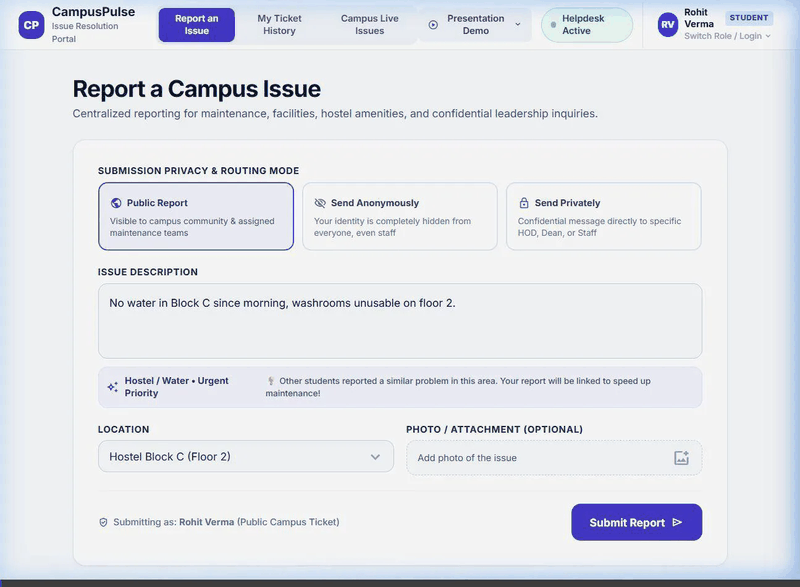
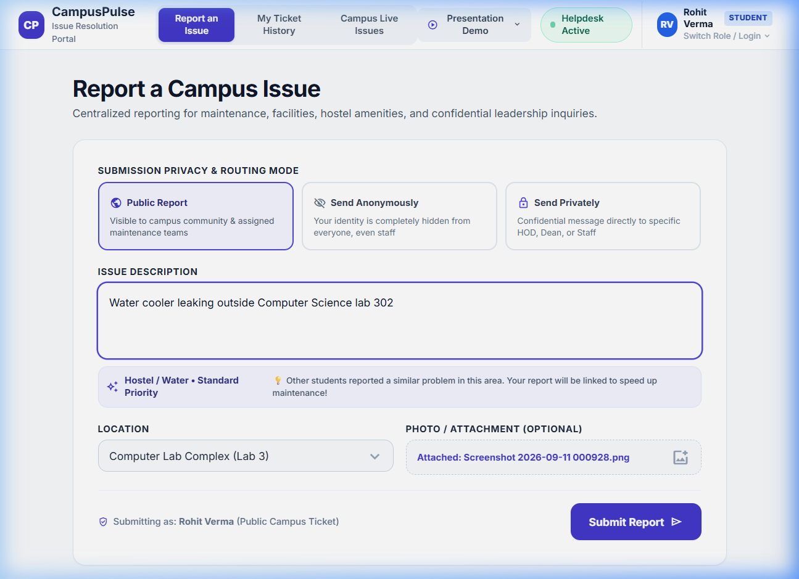
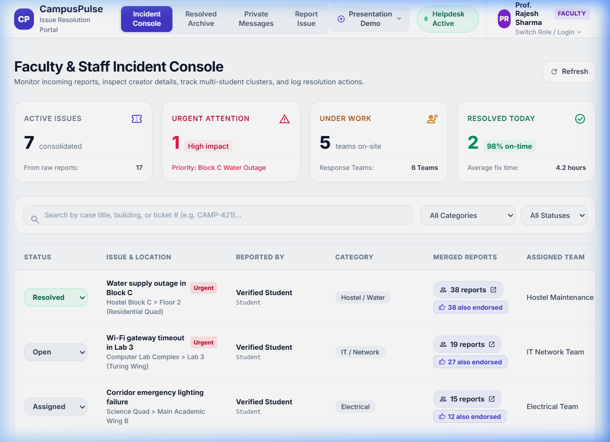
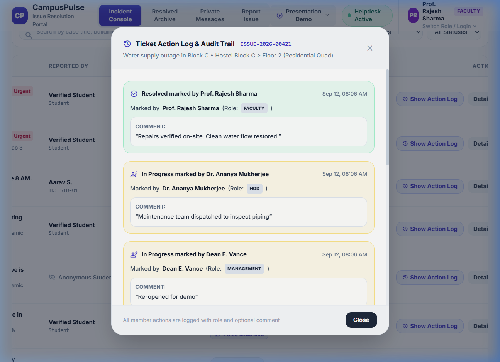
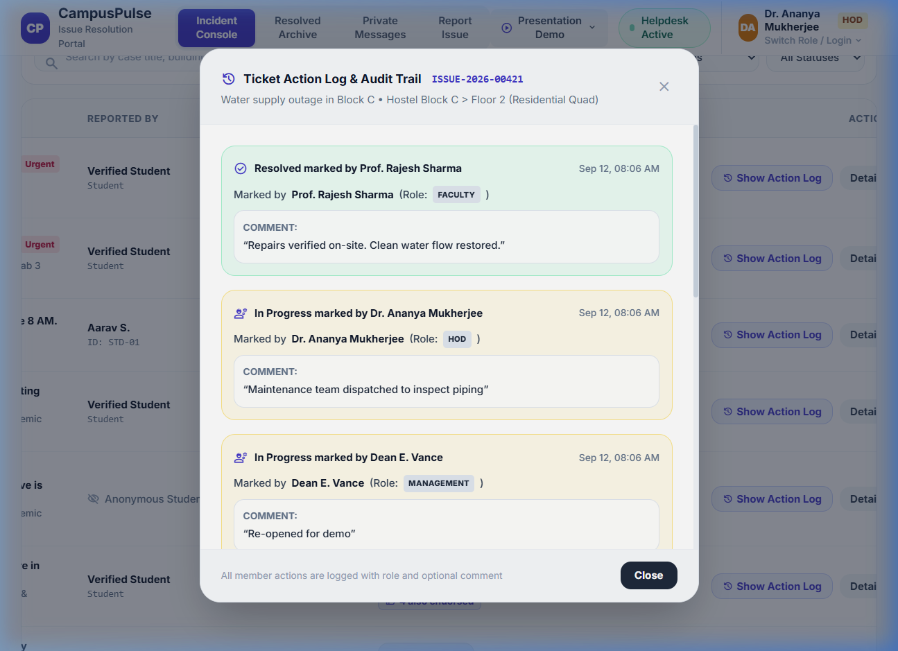
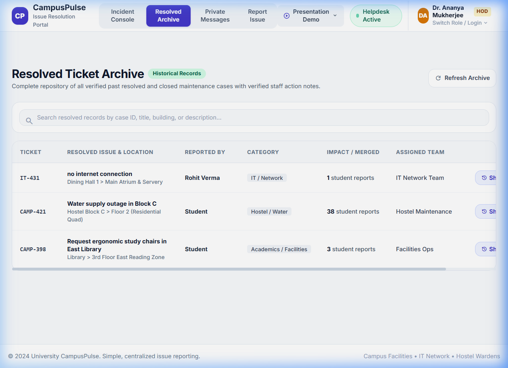
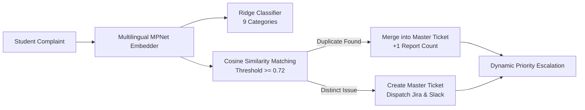

# CampusPulse (Campus+)

> **AI-Powered Multilingual Campus Grievance, Semantic Deduplication & Resolution Operating System**

[](https://fastapi.tiangolo.com)
[](https://www.python.org)
[](https://pytorch.org)
[](https://www.sbert.net)
[]()
[-orange?style=flat)]()
[](https://opensource.org/licenses/MIT)

---

##  Live Demonstration &amp; Visual Tour

### Full End-to-End System Walkthrough (GIF)


*The animated walkthrough illustrates real-time trilingual NLP categorization, duplicate issue clustering, single-vote student endorsements, responsive faculty triage, and the action log audit trail.*

---

### Core System Views

| Student Reporting & Live Feed | Faculty & Staff Incident Console |
| :---: | :---: |
|  |  |
| *Real-time AI categorization banner, location selector, and active issue cards with IST timestamps.* | *Dynamic flexbox layout displaying student creator identities, merged report drawer, and status controls.* |

| Comprehensive Action Log Audit Modal | Leadership & HOD Confidential Inbox |
| :---: | :---: |
|  |  |
| *Transparent historical timeline displaying actor names, roles, IST timestamps, and administrative comments.* | *Confidential communication channel for students to reach HODs and Deans with encrypted replies.* |

| Campus Resolution Archive |
| :---: |
|  |
| *Full-fledged searchable repository of all resolved campus tickets.* |

---

##  Key Problems Solved &amp; Feature Highlights

1. **Trilingual Multilingual AI Classification (English, Hindi, Bengali)**:
   - Understands native scripts and colloquial transliterations (e.g., *"AC is leaking in CS Lab"*, *"वाटर कूलर से पानी बह रहा है"*, *"পানি পড়ার জন্য ল্যাবে শর্টসার্কিট হতে পারে"*).
   - Accurately categorizes issues across 9 campus facility categories.

2. **Vector-Based Semantic Deduplication ($\ge 0.72$ Cosine Similarity)**:
   - Leverages `paraphrase-multilingual-mpnet-base-v2` dense 768-dimensional embeddings to cluster identical complaints into a single master ticket, preventing ticket overload for campus maintenance teams.

3. **Strict Single-Vote Student Endorsement ("I have this issue too")**:
   - Students can endorse existing active issues with a single click (`+1`), directly increasing the ticket's priority score.
   - Enforces a strict **1 vote per student per ticket** database constraint. Non-students (Faculty, HOD, Staff) only see the informational headcount without voting privileges.

4. **Clean Role-Based Access Control (RBAC)**:
   - Dynamic view isolation ensures users **only see tools permissible to their role**.
   - Students only see reporting and tracking; Faculty and Staff only see incident management; Leadership sees confidential grievances.

5. **Action Log Audit Trail with Comments**:
   - Every status transition (e.g., `OPEN` $\rightarrow$ `IN_PROGRESS` $\rightarrow$ `RESOLVED`) captures the **actor name**, **role**, **exact IST timestamp**, and an **optional administrative comment** viewable via the **"Show Action Log"** button.

6. **Confidential Leadership Routing**:
   - Students can send private messages directly to specific HODs or Campus Deans with optional anonymity.
   - Leadership can reply confidentially, and students can view replies directly in **"My Ticket History"**.

7. **Native Indian Standard Time (IST - UTC+05:30)**:
   - All timestamps across incident feeds, action logs, private messages, and Slack alerts display in Indian Standard Time (e.g., `12 Sep, 03:07 PM IST`).

8. **Enterprise Integrations**:
   - Simulated **Jira Service Management** ticket generation and automated **Slack webhook alerts** with rich Block Kit cards.

---

##  Demo User Accounts &amp; Credentials

The system comes pre-populated with **17 registered campus accounts** spanning all five roles (also saved in [`users.txt`](users.txt)):

| Role | Name | Username | Password | Department | Permitted Views |
| :--- | :--- | :--- | :--- | :--- | :--- |
| **Student** | Rohit Verma | `student_rohit` | `student@123` | Computer Science | Report Issue, Live Feed, Ticket History |
| **Student** | Priya Sengupta | `student_priya` | `student@123` | Electronics & Comm. | Report Issue, Live Feed, Ticket History |
| **Student** | Arjun Das | `student_arjun` | `student@123` | Mechanical Eng. | Report Issue, Live Feed, Ticket History |
| **Student** | Neha Roy | `student_neha` | `student@123` | Civil Engineering | Report Issue, Live Feed, Ticket History |
| **Faculty** | Prof. Rajesh Sharma | `prof_sharma` | `faculty@123` | Electrical Eng. | Incident Console, Resolved Archive |
| **Faculty** | Prof. Sunita Gupta | `prof_gupta` | `faculty@123` | Computer Science | Incident Console, Resolved Archive |
| **Faculty** | Prof. Subhash Chatterjee | `prof_chatterjee` | `faculty@123` | Civil & Infrastructure | Incident Console, Resolved Archive |
| **HOD** | Dr. Ananya Mukherjee | `hod_cse` | `hod@123` | Computer Science | Confidential Inbox, Incident Console, Archive |
| **HOD** | Dr. Vikramaditya Roy | `hod_ee` | `hod@123` | Electrical Eng. | Confidential Inbox, Incident Console, Archive |
| **HOD** | Dr. Arundhati Sen | `hod_mech` | `hod@123` | Mechanical Eng. | Confidential Inbox, Incident Console, Archive |
| **Management**| Dean E. Vance | `admin_dean` | `mgmt@123` | Student Affairs | Confidential Inbox, Incident Console, Archive |
| **Management**| Dr. K. S. Ramanujan | `dean_academics` | `mgmt@123` | Academic Affairs | Confidential Inbox, Incident Console, Archive |
| **Management**| Dr. Meera Iyer | `director_campus` | `mgmt@123` | Campus Director | Confidential Inbox, Incident Console, Archive |
| **Staff** | Suresh Singh | `staff_singh` | `staff@123` | Hostel Block C Warden | Incident Console, Resolved Archive |
| **Staff** | Ramesh Kumar | `staff_ramesh` | `staff@123` | Electrical Maintenance | Incident Console, Resolved Archive |
| **Staff** | Anil Karmakar | `staff_anil` | `staff@123` | Plumbing & Sanitation | Incident Console, Resolved Archive |
| **Staff** | Samir Dutta | `staff_it_samir` | `staff@123` | IT Network Helpdesk | Incident Console, Resolved Archive |

> **Quick Switching**: Click the user badge in the top-right corner to open the authentication modal, then choose any account from the 1-click dropdown or chips.

---

##  Architecture &amp; Technical Design

For an in-depth exploration of the system architecture, mathematical formulas, vector clustering algorithms, and database schemas, see **[ARCHITECTURE.md](ARCHITECTURE.md)**.



---

##  Technology Stack

- **Backend**: Python 3.11, [FastAPI](https://fastapi.tiangolo.com/), Uvicorn, SQLite 3 (WAL Mode), Pydantic v2.
- **AI & NLP**: PyTorch, [Sentence-Transformers](https://www.sbert.net/) (`paraphrase-multilingual-mpnet-base-v2`), Scikit-Learn, NumPy.
- **Frontend**: Vanilla JavaScript (ES6+), HTML5, Tailwind CSS, Google Material Symbols, responsive dynamic flexbox.
- **Testing**: Python Requests, Pytest, Playwright driver for end-to-end browser validation.

---

##  Getting Started &amp; Local Setup

### 1. Prerequisites
- **Python 3.11+** installed on your system.
- **Git** installed.

### 2. Clone the Repository
```bash
git clone https://github.com/sahir247/CampusPulse.git
cd CampusPulse
```

### 3. Set Up Virtual Environment
```bash
# Windows
python -m venv .venv
.venv\Scripts\activate

# Linux / macOS
python3 -m venv .venv
source .venv/bin/activate
```

### 4. Install Dependencies
```bash
pip install -r requirements.txt
```

### 5. Launch the Application Server
```bash
# Run with Uvicorn on localhost:8000
uvicorn backend.main:app --host 127.0.0.1 --port 8000 --reload
```

### 6. Open the Application
Navigate to **`http://127.0.0.1:8000/`** in any modern web browser.

---

##  REST API Reference

| Method | Endpoint | Description | Access |
| :--- | :--- | :--- | :--- |
| `POST` | `/api/auth/login` | Authenticate user and receive JWT session token | Public |
| `POST` | `/api/auth/logout` | Terminate session | Authenticated |
| `GET` | `/api/auth/me` | Fetch active user profile and permissions | Authenticated |
| `POST` | `/api/complaints/preview` | Real-time AI categorization and duplicate check | Student |
| `POST` | `/api/complaints` | Submit public, anonymous, or private complaint | Student |
| `GET` | `/api/issues/active` | Get open/active campus issues (filtered) | All Roles |
| `GET` | `/api/issues/resolved` | Get historical archive of resolved issues | All Roles |
| `POST` | `/api/issues/{id}/upvote` | Endorse issue with "I have this issue too" | Student Only |
| `PATCH`| `/api/issues/{id}/status` | Update ticket status with optional comment | Faculty, HOD, Mgmt, Staff |
| `GET` | `/api/issues/{id}/timeline`| Retrieve action log audit history | All Roles |
| `GET` | `/api/messages/private` | Fetch leadership confidential inbox | HOD, Management |
| `POST` | `/api/messages/{id}/reply`| Send confidential reply to student inquiry | HOD, Management |
| `GET` | `/api/recipients` | Directory of campus leadership recipients | All Roles |
| `GET` | `/api/analytics/kpis` | Operational metrics (active, resolved, SLA) | Faculty, HOD, Mgmt |

---

##  Automated Testing &amp; Verification

Run the comprehensive test suites to verify end-to-end functionality:

```bash
# 1. Comprehensive Feature & RBAC Verification Suite
python test_features_v2.py

# 2. Multilingual NLP Classification & Transliteration Suite
python test_trilingual_ai.py

# 3. Authentication & Permission Isolation Suite
python test_auth_rbac.py
```

All test suites should exit with code `0`.

---

##  License
This project is licensed under the **MIT License**.
